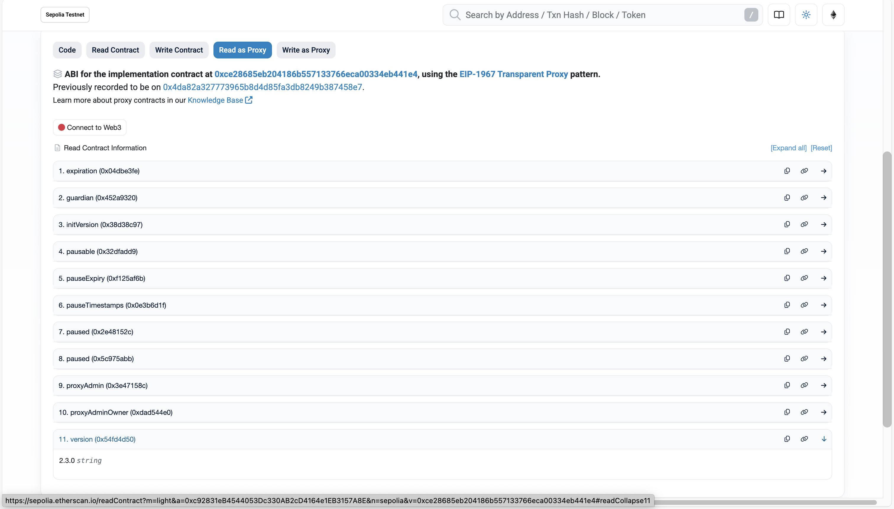

# 039-soneium-upgrade-superchainconfig-v410

Status: [EXECUTED](https://sepolia.etherscan.io/tx/0xe12c44b46f83e4042f3fecbed0d5e4a1893cd93fe3440dd2dfc14c9fa298b568)

```bash
cd src/tasks/sep/039-soneium-upgrade-superchainconfig-v410
# Testing
SIMULATE_WITHOUT_LEDGER=1 just --dotenv-path $(pwd)/.env simulate

# Install dependencies like eip712sign if not already installed
just install

# Execute via Ledger
just --dotenv-path $(pwd)/.env sign

SIGNATURES=0x3fc924fe7a7156a0b5e8bfe016eec5bb7c57981c29e3315fac2052bb7e0359aa3ae1b45d3f598b56c0a58378c3438a928f16bc9173e8034abb8031d197ed9f9d1c just execute
```

Confirmed that `SuperchainConfig` has been upgraded to `v2.3.0` and the implementation address has been updated from `0x4da82a327773965b8d4D85Fa3dB8249b387458E7` to `0xce28685eb204186b557133766eca00334eb441e4`.

https://sepolia.etherscan.io/address/0xc92831eB4544053Dc330AB2cD4164e1EB3157A8E#readProxyContract
